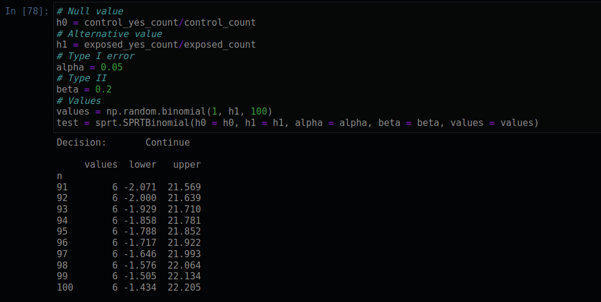
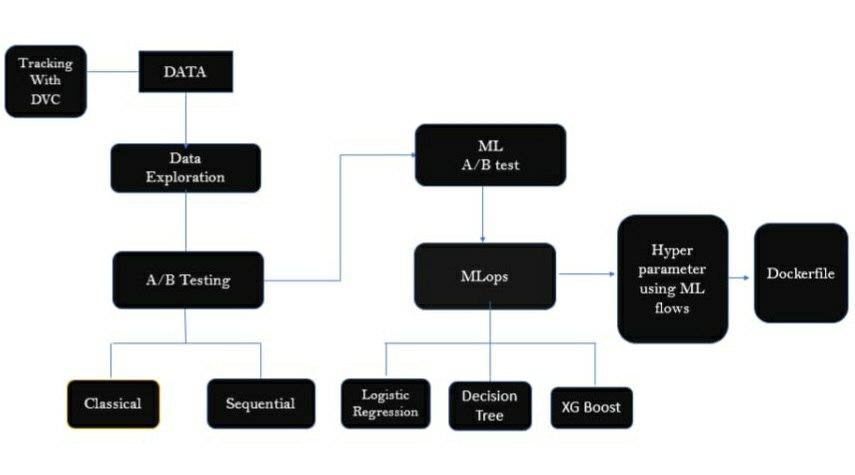

# SmartAd Campaign - A/B Testing

---
The main objective of this project is to evaluate if the ads that smartAd company runs resulted in a significant lift in brand awareness. 

We will cover:

    Setting up  classical & sequencial A/B tesing framework.
    Extracting statistically valid insights in relation to the business objective.
    Draw conclusion based on the satistical insights.

## Data & Background

- The BIO data for this project is a “Yes” and “No” response, of online users on the  question.
    Q: Do you know the brand Lux?

        O Yes
        O No

- Two types of user were using for the experiment, control & expose

    Control: users who have been shown a dummy ad

    Exposed: users who have been shown a creative (ad) that was designed by SmartAd for the client.

Control group engagment analysis

Expose group engagment analysis

P and t value for the groups

sequential analysis

ml workflow

## Conclusion
Accorfing to the classical A/B Test the ads that the advertising company runs did not result in a significant lift in brand awareness.

## Install

git clone https://github.com/Abel-Blue/smartAd-abTest
cd smartAd-abTest
pip install -r requirements.txt

## Contributirs

Made with [contrib.rocks](https://contrib.rocks)